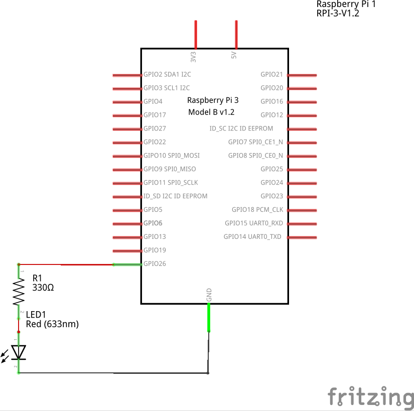

# 1. Blink LED 

Blinking LED in embedded is considered as running "Hello World" in programming

## 1. Breadborad


## 2. Schematic



## 3. Source code

```
# Import necessary modules
import RPi.GPIO as GPIO
import time

HIGH = True
LOW = False

# Set up GPIO pins
GPIO.setmode(GPIO.BCM)

pins = [26]
for pin in pins:
    GPIO.setup(pin,GPIO.OUT)

def setup():
    # setup somthing (do 1 time)
    GPIO.output(26,LOW)
    

def loop():
    # continuously do somthing
    try:
        while True:
            GPIO.output(26,HIGH)
            time.sleep(0.5)
            GPIO.output(26,LOW)
            time.sleep(0.5)

    except KeyboardInterrupt: # if Ctrl C is pressed...
        print("Program stopped and furnace shut off.") # print a clean exit message
    GPIO.cleanup()


def main():
    setup()
    loop()

if __name__ == '__main__':
    main()


```

## 4. Explanation

### 4.1 Import necessary modules

```
import RPi.GPIO as GPIO
```

### 4.2 Setup type of GPIO pins

- GPIO.BCM option is considering number of pins as numbers of GPIO.
```
GPIO.setmode(GPIO.BCM)
```

- GPIO.BOARD option is considering number of pins as numbers of plug pins (in the red frame). 
```
GPIO.setmode(GPIO.BOARD)
```


### 4.3 Setup mode Output for pins

Syntax:
```
GPIO.setup(pin,GPIO.OUT)
```

Variable 'pin' could be the number of pin corresponding the number in BCM option or BOARD option as above.

`GPIO.OUT` means we want the 'pin' is set in Output mode. I will cover the Input mode in the next section.

### 4.4 Configure the setup() function

Syntax:
```
def setup():
    pass
    # setup somthing
```

In this function, we initialize values and functions.

### 4.5 Configure the loop() functions

Syntax:
```
try:
    while True:
        GPIO.output(26,HIGH)
        time.sleep(0.5)
        GPIO.output(26,LOW)
        time.sleep(0.5)

except KeyboardInterrupt: # if Ctrl C is pressed...
    print("Program stopped and furnace shut off.") # print a clean exit message
```

In 'try', we have while statement to continously do something. 'except' statement is used to configure board when you quit the program.

### 4.6 Clean up program

Syntax:
```
GPIO.cleanup()
```

RPi.GPIO provides a built-in function GPIO.cleanup() to clean up **all the ports you’ve used**. But be very clear what this does. **It only affects any ports you have set in the current program**. It resets any ports you have used in this program back to input mode. This prevents damage from, say, a situation where you have a port set HIGH as an output and you accidentally connect it to GND (LOW), which would short-circuit the port and possibly fry it. Inputs can handle either 0V (LOW) or 3.3V (HIGH), so it’s safer to leave ports as inputs.

### 4.7 Conventional Python programming

```
def main():
    setup()
    loop()

if __name__ == '__main__':
    main()
```

Learn more about [if __name__ == '__main__'](https://stackoverflow.com/questions/419163/what-does-if-name-main-do) in Python.


