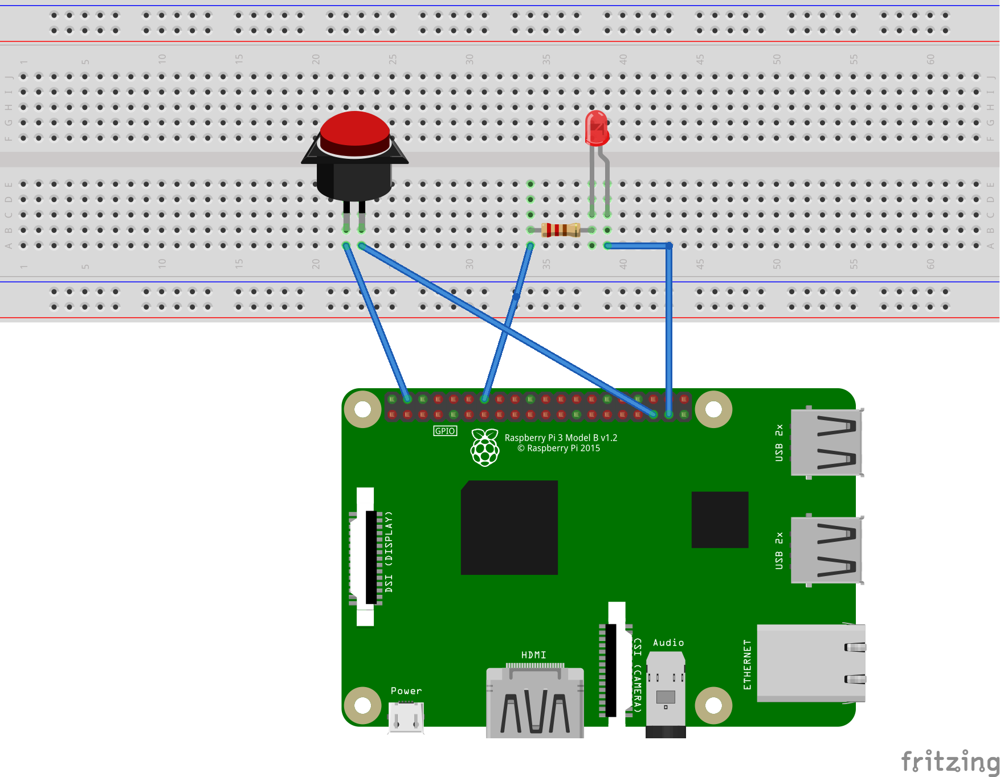
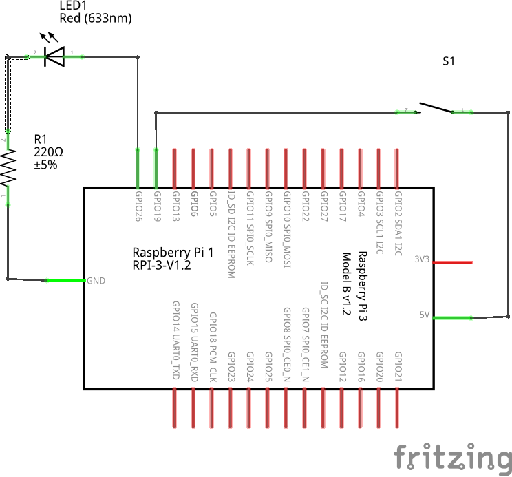

# 2. Control LED with button

In this tutorial, we will use button to change the state of LED.

## 1. Breadborad



## 2. Schematic



## 3. Source code

```
# Import necessary modules
import RPi.GPIO as GPIO
import time

HIGH = True
LOW = False

LED = 26
BUTTON = 19

# Set up GPIO pins
GPIO.setmode(GPIO.BCM)

# pull_up_down=GPIO.PUD_DOWN or pull_up_down=GPIO.PUD_UP
GPIO.setup(BUTTON, GPIO.IN, pull_up_down=GPIO.PUD_DOWN) 
GPIO.setup(LED,GPIO.OUT)

def setup():
    # setup somthing (do 1 time)
    global i
    i = 0
    GPIO.output(LED,LOW)
    

def loop():
    # continuously do something
    global i, LED, BUTTON
    
    try:
        while True:
            # Read button state
            if GPIO.input(BUTTON):
                GPIO.output(LED,HIGH)
            else:
                GPIO.output(LED,LOW)
            
            # wait 10 ms to give CPU chance to do other things
            time.sleep(0.01)
            print(i)
            i += 1

    except KeyboardInterrupt: # if Ctrl C is pressed...
        print("Program stopped and furnace shut off.") # print a clean exit message
    GPIO.cleanup()


def main():
    setup()
    loop()

if __name__ == '__main__':
    main()
```

## 4. Explanation

### 4.1 Setup input pins

```
GPIO.setup(19, GPIO.IN, pull_up_down=GPIO.PUD_DOWN) 
```

This line setup pin 19 as input pin. However, when you set a pin as input pin, you need to give it a state (LOW or UP) or it will be considered as 'floating pin' (neither HIGH nor LOW). 

There are a few ways to give the state for an input pin. 

- Hardware: You connect a resistor in series with the button.
- Software: You set a pin as either pull up or pull down (recommend).

**Set pull up**: **`GPIO.setup(pin, GPIO.IN, pull_up_down=GPIO.PUD_UP)`**

**Set pull down**: **`GPIO.setup(pin, GPIO.IN, pull_up_down=GPIO.PUD_DOWN)`**

### 4.2 Read the state of a button 

When the state of input pin returns `True`, it means its state is `HIGH`. Otherwise (return `False`), its state is `LOW`.

```
if GPIO.input(19):
    GPIO.output(26,1)
else:
    GPIO.output(26,0)
```

In this part of code, I want to turn on the LED when I press the button.

<br>

### Next: [3. Pulse-width modulation](3-PWM.md)