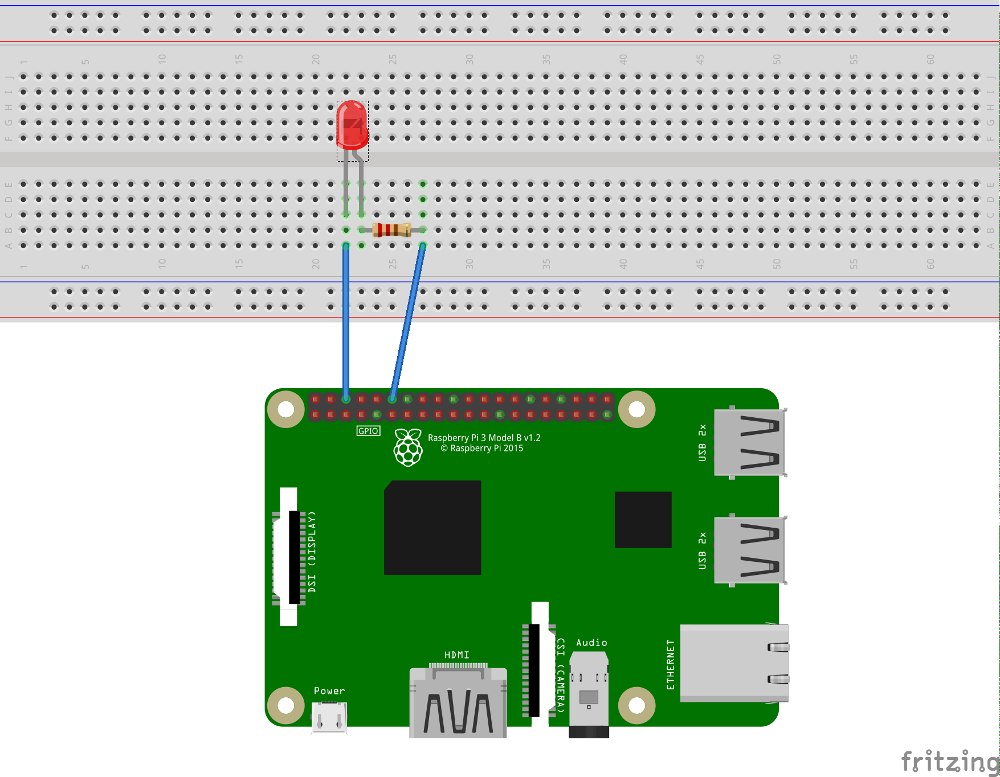
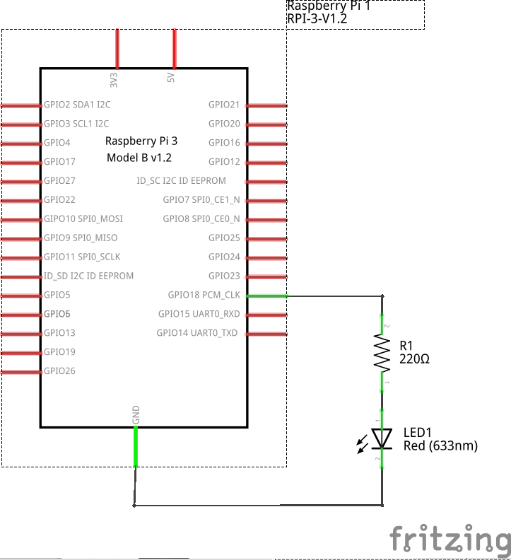

# 3. Pulse-width modulation

PWM (Pulse Width Modulation) is a modulation technique by which the width of pulse is varied while keeping the frequency constant.

Through PWM technique, we can control the power delivered to the load by using ON-OFF signal.

The PWM signals can be used for applications such as controlling the speed of DC motors, changing intensity of an LED, controlling Servo motors, etc.

The GIF shown below depicts the use of PWM for intensity control of an LED.


## 3.1 Raspberry Pi PWM

Raspberry Pi has two PWM channels i.e. PWM0 and PWM1.

PWM pins for the two PWM channels on 40-pin P1 header are as follows:

| GPIO Pin    | PWM0/PWM1   |
| :----:      | :----:      |
| GPIO12      | PWM0        |
| GPIO18      | PWM0        |
| GPIO13      | PWM1        |
| GPIO19      | PWM1        |

The PWM pins on Raspberry Pi 3/4 Model B 40-pin P1 Header is shown in below figure:


The PWM pins on Raspberry Pi are shared with audio subsystem. Thus, we can have either PWM output or Audio output.

## 1. Breadborad



## 2. Schematic



## 3. Source code

```
import time
import RPi.GPIO as GPIO

GPIO.setmode(GPIO.BCM)

LED = 18 # PWM pin connected to LED

GPIO.setup(LED, GPIO.OUT) 

HIGH = True
LOW = False

p = GPIO.PWM(LED, 50)  # channel=12 frequency=50Hz
p.start(0)

try:
    while 1:
        for dc in range(0, 101, 5):
            p.ChangeDutyCycle(dc)
            time.sleep(0.1)
            print(round(time.time() * 1000))
        for dc in range(100, -1, -5):
            p.ChangeDutyCycle(dc)
            time.sleep(0.1)
except KeyboardInterrupt:
    print("Program stopped and furnace shut off.") # print a clean exit message
    p.stop()
    
GPIO.cleanup()
```

## 4. Explanation

**Create PWM Object**

Create an Object of class PWM which is a part of RPi.GPIO library. Here, we have created Object of name **pi_pwm**. We can provide any name for Object.

E.g.

pi_pwm = GPIO.PWM (Pin no., frequency)

Where,

**Pin no.** – PWM pin no on which PWM will be generated.

**Frequency** – frequency of PWM

Now, we can call PWM functions of RPi.GPIO library by using PWM object.

**Note:** The PWM which is generated here is Software PWM and can generate on any GPIO pin.

**start (Duty Cycle)**

It is used to start PWM generation of specified Duty Cycle.

**ChangeDutyCycle(Duty Cycle)**

This function is used to change the Duty Cycle of signal. We have to provide Duty Cycle in the range of 0-100.

**ChangeFrequency(frequency)**

This function is used to change the frequency (in Hz) of PWM. This function we have not used in above program. But, we can use it for changing the frequency.

**stop()**

This function is used to stop the PWM generation.


Reference: https://www.electronicwings.com/raspberry-pi/raspberry-pi-pwm-generation-using-python-and-c

<br>

### Next: [4. Control DC motor with PWM](4-control-DC-motor-with-PWM.md)
