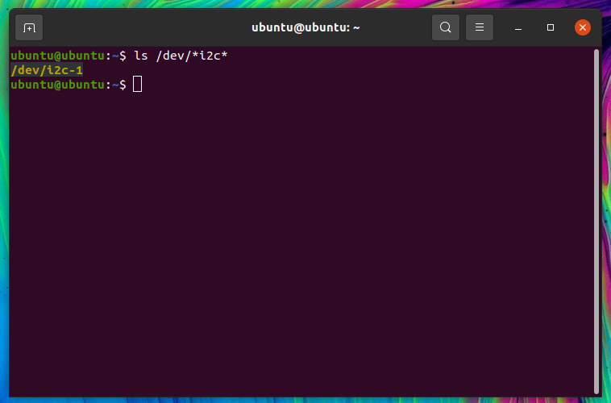

# 5. Inter-integrated Circuit (I2C)

## 1. Introduction

- I2C (Inter Integrated Circuit) is a synchronous serial protocol that communicates data between two devices.

- It is a master-slave protocol which may have one master or many master and many slaves whereas SPI has only one master.

- It is generally used for communication over short distance.

- The I2C device has 7-bit or 10-bit unique address. So, to access these devices, master should address them by the 7-bit or 10-bit unique address.

- I2C is used in many applications like reading RTC (Real time clock), accessing external EEPROM memory. It is also used in sensor modules like gyro, magnetometer etc.
It is also called as Two Wire Interface (TWI) protocol.

## 2. Raspberry Pi I2C

- Raspberry Pi has Broadcom processor having Broadcom Serial Controller (BSC) which is a master, fast-mode (400Kb/s) BSC controller. The BSC bus is compliant with the Philips I2C bus.

- It supports both 7-bit and 10-bit addressing.

- It also has BSC2 master which is dedicatedly used with HDMI interface and should not be accessed by user.

- I2C bus/interface is used to communicate with the external devices like RTC, MPU6050, Magnetometer, etc with only 2 lines. We can connect more devices using I2C interface if their addresses are different.

To access I2C bus in Raspberry Pi, we should make some extra configuration. Raspberry Pi has I2C pins which are given as follows.

## 3. Raspberry Pi I2C Pins


## 4. Raspberry Pi I2C Configurations

Before start interfacing I2C devices with Raspberry some prior configurations need to be done. These configurations are given as follows.

First, we should enable I2C in Raspberry Pi. We can enable it through terminal which is given below:

```
sudo raspi-config
```

### 4.1: Fix 'command not found'

If you get 'command not found' error, you should read this part. Otherwise, skip part 4.1.

```
sudo: raspi-config: command not found
```

You can fix it by running the following commands:

```
wget http://mirrors.ustc.edu.cn/archive.raspberrypi.org/debian/pool/main/r/raspi-config/raspi-config_20200601_all.deb
sudo apt install lua5.1  libatopology2 libfftw3-single3 libsamplerate0 alsa-utils
sudo dpkg -i raspi-config_20200601_all.deb
```


### 4.2 Start the configurations

At this step, when you run `sudo raspi-config` your terminal should display as follows:


**Select Interfacing Configurations**


**In Interfacing option, Select -> I2C**


**Enable I2C configuration**


**Reboot the Raspberry Pi**

Press 'Esc' and run command:

```
sudo reboot
```

Now, after booting raspberry Pi, we can check user-mode I2C port by entering following command.

```
ls /dev/*i2c*
```

then Pi will respond with name of i2c port.



## 4.3 Scan/Test I2C device on Raspberry Pi

Now, we can test/scan for any I2C device connected to our Raspberry Pi board by installing i2c tools. We can get i2c tools by using **apt** package manager. Use following command in Raspberry Pi terminal.

Open terminal and run:

```
sudo apt install -y i2c-tools
```
Now connect any I2C based device to the user-mode port and scan that port using the following command:

```
sudo i2cdetect -y 1
```

In my case, I am using OLED display with address 3c. Then, its address should be indicated on terminal.

