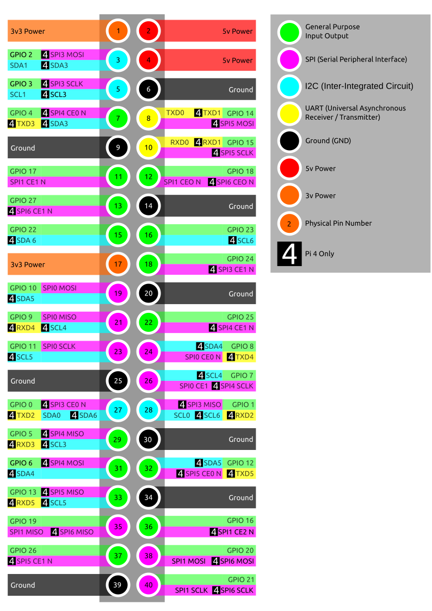

# Raspberry Pi 4B Python Programming

In this series, I will cover all the basic work with peripherals of Raspberry Pi 4. Programmer can use either C/C++ language or Python language. There are several tutorials programmed in C and C++ in other sources; therefore, I want to focus only on Python Programming.

## 1. Prerequisites

- Raspberry Pi 3B+ with OS
- Installed IDE (Visual Studio Code, IDLE, Geany, Thonny).
- Basic Python programming  

In my opinion, I suggest that you should use Visual Studio Code since "Visual Studio Code is a lightweight but powerful source code editor which runs on your desktop and is available for Windows, macOS and Linux".

## 2. Installing RPi.GPIO library

Open a new terminal.

If you are using Python 2.x, run these commands:

    sudo apt update
    sudo apt upgrade
    sudo apt install python-rpi.gpio

If you are using Python 3.x, run these commands:

    sudo apt update
    sudo apt upgrade
    sudo apt install python3-rpi.gpio

## 3. Start your first lesson

Once you complete all above tutorials, you can start you first project.

Let's start with the first Section: [1. Blink LED](1-blink-LED.md)